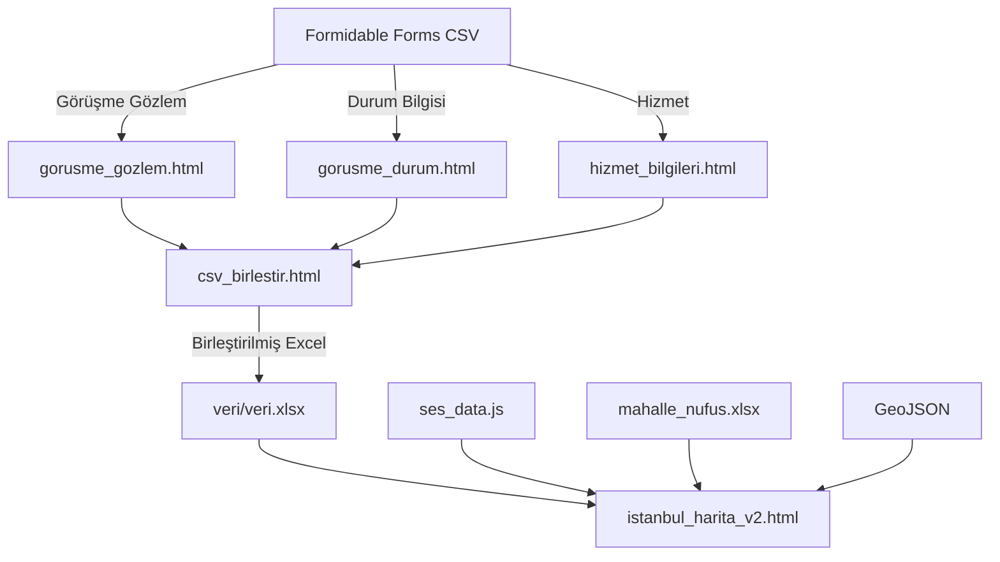

# 🏛️ Sosyalrisk Sistemi - Kapsamlı Analiz

## 📋 Genel Bakış

**Sosyalrisk**, İstanbul'daki sosyal sorunların ve dezavantajlı grupların coğrafi ve istatistiksel analizini yapan bir **saha koordinasyon araçları** sistemidir. Tamamen tarayıcı tabanlı çalışır (sunucu gerektirmez).

---

## 🗂️ Proje Yapısı

```
sosyalrisk-main/
├── index.html                 # Ana portal (giriş noktası)
├── istanbul_harita_v2.html    # İnteraktif İstanbul haritası
├── csv_birlestir.html         # CSV birleştirici (önerilen)
├── gorusme_gozlem.html        # Görüşme gözlem formu işleyici
├── gorusme_durum.html         # Görüşme durum bilgisi işleyici
├── hizmet_bilgileri.html      # Hizmet bilgileri dönüştürücü
├── nufus_metodoloji.html      # Nüfus normalizasyonu metodolojisi
├── ses_data.js                # Sosyo-ekonomik skor verileri
├── ses_data.json              # SES verileri (JSON format)
├── ilçe.geojson               # İlçe sınırları (GeoJSON)
├── mahalle.json               # Mahalle sınırları
├── mahalle_nufus.xlsx         # Mahalle nüfus verileri
├── mahalle_ses.json           # Mahalle SES skorları
├── Mahalle SES.xlsx           # Excel formatında SES verileri
├── veri/
│   └── veri.xlsx              # Ana veri dosyası
└── csv_to_excel_converter.py  # Python alternatifi
```

---

## 🔧 Modüller

### 1. **Ana Portal** (`index.html`)
**Başlık:** İlçe Sorumluları - Saha Koordinasyon Araçları

Tüm araçlara erişim sağlayan giriş noktası:
- **İstanbul Haritası** bağlantısı
- **Veri Araçları** bölümü (CSV dönüştürücüler)

---

### 2. **İstanbul Sosyal Haritası** (`istanbul_harita_v2.html`)
**En kapsamlı modül** - ~2000 satır JavaScript

#### Özellikler:
- **Leaflet.js** tabanlı interaktif harita
- **İlçe/Mahalle** görünüm modları
- **Veri kaynakları:**
  - Sosyal Sorunlar
  - Dezavantajlı Gruplar

#### Veri Akışı:
```
veri/veri.xlsx → Excel okuma → İşleme → Harita renklendirme
```

#### Ana Fonksiyonlar:
| Fonksiyon | Açıklama |
|-----------|----------|
| `loadData()` | Excel verilerini yükler |
| `loadNufusData()` | Nüfus verilerini yükler |
| `processSosyalData()` | Sosyal sorun verilerini işler |
| `processDGData()` | Dezavantajlı grup verilerini işler |
| `getColor()` | Renk skalası hesaplar |
| `updateIlceOrtalamalari()` | İlçe ortalamalarını normalize eder |
| `selectIlce()` | İlçe seçimi ve zoom |
| `renderSidebar()` | Yan panel güncelleme |

#### Renk Paleti:
```javascript
DEZAVANTAJ_COLORS = {
    'ÇOCUK': '#29b6f6',
    'ENGELLI': '#00bfa5',
    'EVSIZ': '#9c27b0',
    'GÖÇMEN': '#ff9800',
    'KADIN': '#ec407a',
    'LGBTI+': '#7e57c2',
    'ROMAN': '#8d6e63',
    'YASLI': '#78909c'
};
```

---

### 3. **CSV Birleştirici** (`csv_birlestir.html`)
**Üç farklı CSV dosyasını birleştirir:**

1. Görüşme Gözlem CSV
2. Görüşme Durum Bilgisi CSV
3. Hizmet Bilgileri CSV

#### Çıktı Sayfaları:
- `Gorusme_Durum_Birlestirilmis`
- `GG_Ozet`
- `GG_Mahalle_Pivot`
- `GG_Dezavantajli_Mah_Pivot`
- `GG_Risk_Analizi`
- `HB_Hizmet_Bilgileri`

---

### 4. **Görüşme Gözlem** (`gorusme_gozlem.html`)
CSV dosyasını normalize Excel'e dönüştürür.

#### Pivot Fonksiyonları:
| Fonksiyon | Çıktı |
|-----------|-------|
| `createBolgeselPivot()` | Bölgesel özet |
| `createBolgeselSayimPivot()` | Sayım pivot |
| `createSosyalPivot()` | Sosyal sorun pivot |
| `createMahallePivot()` | Mahalle bazlı pivot |
| `createDezavantajliMahallePivot()` | DG mahalle pivot |
| `createDezavantajliSorunPivot()` | DG sorun pivot |
| `createRiskAnalizi()` | Risk analizi |

#### Kategori Tanımları:
```javascript
KATEGORI_TANIMLARI = [
    'BİREY/AİLE', 'TOPLUM', 'FİZİKSEL ÇEVRE', 
    'KENTSEL HİZMETLER VE KURUMSAL', 'İSTİHDAM VE EKONOMİK KOŞULLAR'
];

DEZAVANTAJLI_GRUPLAR = [
    'Çocuk', 'Kadın', 'Engelli', 'Yaşlı', 'Lgbti+', 
    'LGBTI+', 'Göçmen', 'Evsiz', 'Roman', 'Genç', 'Genel'
];
```

---

### 5. **Görüşme Durum** (`gorusme_durum.html`)
- Görüşme durum bilgisi CSV → Excel dönüşümü
- **Aynı Aktör ID** tekilleştirme (en son timestamp esas)

---

### 6. **Hizmet Bilgileri** (`hizmet_bilgileri.html`)
- CSV → Excel dönüşümü
- **Virgüllü değer ayırma** seçeneği:
  - "ÇOCUK, KADIN" → 2 ayrı satır VEYA tek satır

---

### 7. **Nüfus Metodolojisi** (`nufus_metodoloji.html`)
4. kök normalizasyonu metodolojisini açıklar:

```
Normalize = Toplam / (Nüfus ^ 0.25)
```

**Neden 4. kök?**
- Tam normalize: Küçük nüfuslu yerler abartılır (Adalar problemi)
- 4. kök: Nüfus etkisi %25 seviyesinde tutulur

---

## 📊 Veri Yapıları

### SES (Sosyo-Ekonomik Skor) Verileri
`ses_data.js` içinde her mahalle için:
```javascript
{
    "ilce": "KADIKÖY",
    "mahalle": "CAFERAĞA",
    "ses_skor": 100.0  // 0-100 arası
}
```

### GeoJSON Yapısı
İlçe ve mahalle sınır verileri:
- `ilçe.geojson` - İlçe poligonları
- `mahalle.json` - Mahalle poligonları

---

## 🔄 Veri Akışı



---

## 🛠️ Teknolojiler

| Kategori | Teknoloji |
|----------|-----------|
| **Harita** | Leaflet.js 1.9.4 |
| **Excel İşleme** | SheetJS (xlsx.full.min.js) 0.18.5 |
| **CSS** | Vanilla CSS, Flexbox, CSS Grid |
| **JavaScript** | ES6+, async/await |

---

## 📌 Önemli Notlar

1. **Tüm işlemler tarayıcıda** - Veri sunucuya gönderilmez
2. **GitHub Pages uyumlu** - Statik hosting yeterli
3. **Pattern-based sütun tanıma** - Form genişlese de çalışır
4. **Türkçe karakter normalizasyonu** - İ/I, Ş/S vb. dönüşümler

---

## 🎯 Kullanım Senaryosu

1. **Saha personeli** Formidable Forms ile veri toplar
2. **CSV dosyaları** export edilir
3. **csv_birlestir.html** ile birleştirilir
4. **istanbul_harita_v2.html** ile görselleştirilir
5. **Risk analizi** ve **pivot tablolar** oluşturulur

---

*Analiz Tarihi: 2026-01-17*
